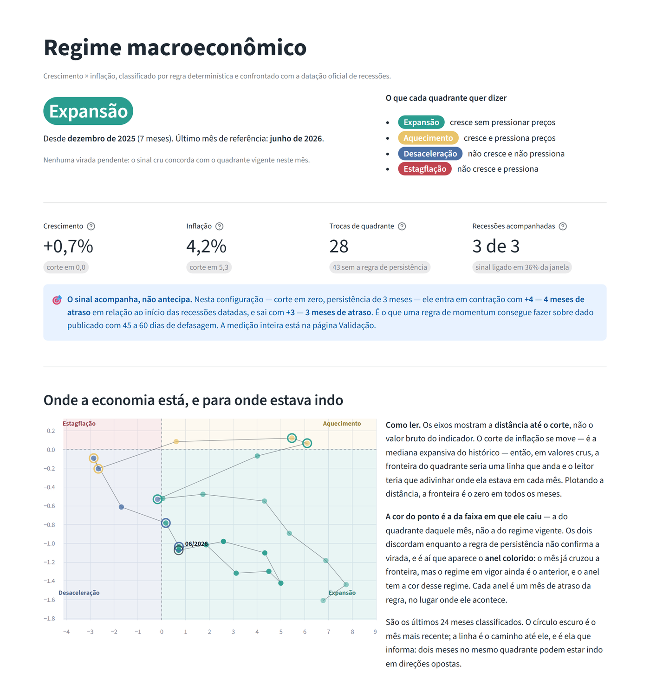
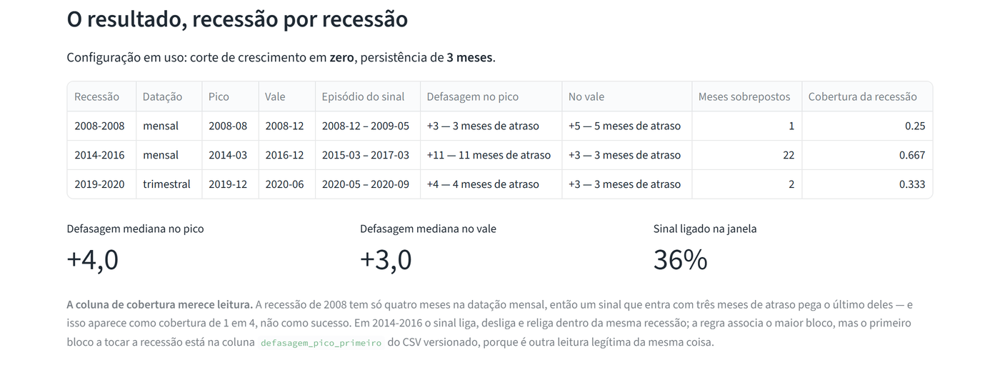
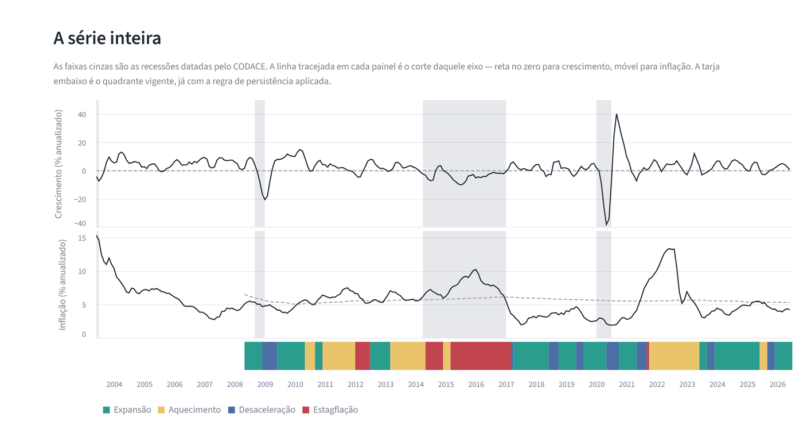
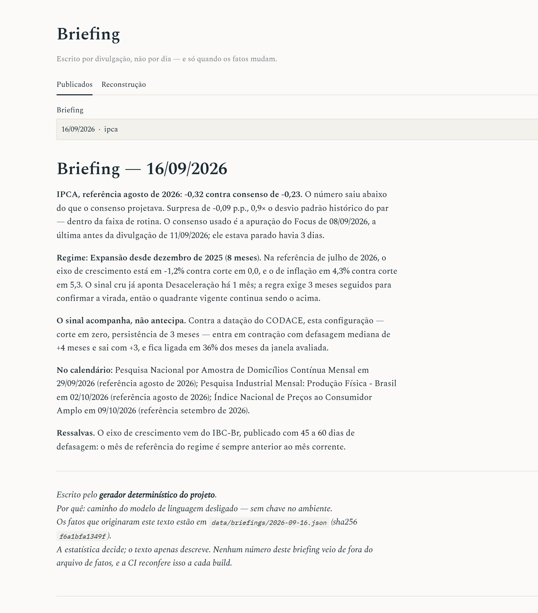

# ciclo-br

**Classificador de regime macroeconômico brasileiro, com pipeline reprodutível e
briefing por divulgação.**

O projeto coleta séries oficiais do Banco Central e do IBGE, classifica o estado
do ciclo em quadrantes de crescimento × inflação, confronta essa classificação
com a datação oficial de recessões do CODACE, mede a surpresa de cada divulgação
contra o consenso do Focus, e publica um briefing — mas só quando há dado novo.

[](https://regimemacro.streamlit.app)


### ▶ [regimemacro.streamlit.app](https://regimemacro.streamlit.app)

[](https://regimemacro.streamlit.app)

Seis páginas: **Regime**, **Briefing**, **Séries**, **Surpresas**, **Validação** e
**Metodologia**. A primeira abertura leva algum tempo, porque o servidor hiberna
quando ninguém visita.

Para rodar na sua máquina:

```bash
pip install -r requirements.txt && streamlit run app.py
```

No Windows, [`scripts/abrir-painel.cmd`](scripts/abrir-painel.cmd) faz isso
sozinho: cria o ambiente na primeira vez, sobe o servidor e abre o navegador
quando ele responde. Funciona a partir de um clone limpo e **sem rede** — todos
os dados estão versionados no repositório.

---

## Por que este projeto é diferente de um painel de indicadores

A maior parte dos dashboards macro de portfólio empilha gráficos e detecta
outliers estatísticos. Cinco decisões afastam este daqui disso.

### 1. O classificador é validado contra uma datação oficial

A série de quadrantes é confrontada com a cronologia de ciclos do **CODACE**
(FGV/IBRE), e a métrica principal é a **defasagem** do sinal, não a taxa de
acerto. Taxa de acerto penalizaria o sinal por fazer exatamente aquilo para que
foi construído — e, com o sinal ligado a maior parte do tempo, "detectou todas as
recessões" vira quase tautologia.



A validação não é um selo: **ela mudou o projeto duas vezes.** Encontrou um
travamento na regra de persistência que produzia um episódio de contração de 116
meses, e derrubou o corte do eixo de crescimento — com a mediana histórica o sinal
ficava ligado em 81% dos meses da janela; com corte em zero fica em 36% e
acompanha as recessões com três a quatro meses de atraso. A varredura inteira,
com as doze configurações medidas pela mesma régua, está versionada em
[`validacao_resumo.csv`](data/derivado/validacao_resumo.csv) e explicada na
[seção 7 da metodologia](docs/metodologia.md).

A janela de validação contém **três recessões**, e é exatamente por isso que o
classificador é uma regra de sinal e não um modelo com parâmetros estimados.



### 2. A surpresa é medida contra o consenso da véspera, não contra a média

Para cada divulgação, o projeto recupera a data em que o número foi ao ar (do
calendário do IBGE) e a **última mediana do Focus apurada antes dela**. Em 117
divulgações do IPCA a surpresa média é **+0,01 p.p.** — que é o teste da montagem
inteira: consenso não enviesado dá média zero. Se a referência estivesse trocada
ou a data deslocada, essa média não seria zero.

Nas séries que são revisadas a média não é zero, e isso está medido e explicado
em vez de escondido: o PIB mostra viés de **+0,41 p.p.**, e na desocupação as
duas explicações possíveis competem sem que os dados decidam entre elas — fica
declarado como indeterminado.

### 3. A estatística decide, o modelo de linguagem apenas descreve — e é conferido

O LLM recebe um **JSON fechado** de fatos já apurados, com os valores já
formatados como string, e não tem ferramenta, busca nem histórico.

Isso ainda seria só uma promessa, então há uma verificação: **todo número escrito
precisa estar na lista de números permitidos daquele JSON**. Um valor fora da
lista reprova o texto inteiro, que é descartado — não corrigido, porque decidir
qual parte estava certa não tem como ser automático — e o gerador determinístico
assume. O rodapé diz qual dos dois escreveu e, quando houve recusa, o motivo.
Cada briefing fica versionado junto com o JSON que o originou, e
[um portão de CI](#oito-portões-de-ci) reconfere todos eles a cada build.



**Hoje o caminho do LLM está desligado**, e os briefings deste repositório saíram
todos do gerador determinístico — o rodapé de cada um diz isso, e
[`indice.csv`](data/briefings/indice.csv) registra a série inteira. Ligar é uma
variável de ambiente; não ligar não tira nada do briefing, e é o teste mais
direto da afirmação que abre este item: se o texto continua completo sem o
modelo, é porque ele nunca carregou informação que a estatística não tivesse
produzido antes.

### 4. Nenhum dado é sobrescrito

Não existe base de vintages pública para séries brasileiras. Este projeto
constrói a sua: cada observação é gravada com a data em que foi coletada, e uma
revisão retroativa do Banco Central vira **uma linha nova** em vez de apagar a
anterior. O histórico de commits é o histórico de coletas.

O mesmo mecanismo guarda a trajetória diária do consenso do Focus — e é isso que
torna possível saber o que o mercado esperava na véspera de uma divulgação de
2017.

### 5. O painel só lê arquivo

Nenhuma página do dashboard importa a camada de ingestão ou chama API: tudo o que
aparece na tela saiu de um arquivo versionado, e **dois testes travam essa
regra** — um lê o código-fonte e proíbe o import, outro confere em tempo de
execução que a ingestão não foi carregada nem por caminho indireto.

A consequência é que a tela não tem como divergir do pipeline, o app abre
offline, e voltar o repositório a um commit anterior faz o painel mostrar o que
ele mostrava naquele dia — sem nenhum modo especial. O que ele **não** tem é um
seletor de "como estava em março de 2015": reconstruir aquela tela com o dado
revisado de hoje seria o viés de look-ahead que o resto do projeto existe para
evitar.

> O que o projeto **não** faz: previsão, recomendação de investimento, ou
> qualquer julgamento delegado a um modelo de linguagem.

---

## Arquitetura

```
  SGS/BCB  ──┐
             ├──►  ingestão  ──►  Parquet append-only  ──►  DuckDB  ──┬──►  classificador de regime  ──┐
  Focus/BCB ─┤       (retry,        (serie, data_ref,      (consulta) │         (quadrante)           ├──►  briefing  ──►  painel
             │      fatiamento)      data_coleta)                     └──►  surpresa vs. Focus  ───────┘   (md + json)    (Streamlit)
  Calendário ┘                                                                                                  ▲
   IBGE                                                                                    Haiku 4.5, verificado,
                                                                                           ou gerador determinístico
```

**O repositório é o banco de dados.** Um arquivo Parquet por série, versionado no
Git. Arquivo DuckDB binário foi descartado de propósito: não versiona bem, e o
objetivo é que cada commit automático mostre exatamente o que mudou.

**A cadência é por divulgação, não diária.** O job roda todo dia útil, compara o
que a API devolve com o que já está gravado, e só escreve briefing quando os
fatos mudam — divulgação nova, troca de quadrante, virada entrando em pendência.
Na maior parte dos dias ele fica calado. Um sistema que sabe não falar é mais
útil que um que parafraseia estabilidade.

#### Oito portões de CI

Rodando sobre os dados versionados, a cada push:

| Portão | O que pega |
|---|---|
| `ruff` | estilo e importação morta |
| `pytest` | 222 testes, incluindo a renderização das seis páginas |
| `ciclo-qualidade` | série vazia, buraco na grade, série parada |
| `ciclo-transformar --verificar` | dado bruto versionado sem recalcular os eixos |
| `ciclo-regime --verificar` | camada derivada nova sem reclassificar |
| `ciclo-validar --verificar` | classificador alterado sem remedir a defasagem |
| `ciclo-surpresa --verificar` | realizado novo sem remedir a surpresa |
| `ciclo-briefing --auditar` | número no briefing que não está nos fatos dele |

Um pipeline que quebra alto vale mais que um que grava lixo em silêncio.

---

## Dados

16 séries, todas com ficha obrigatória em [`config/series.yaml`](config/series.yaml)
declarando fonte, código, unidade, periodicidade, tratamento sazonal, papel no
projeto e transformação aplicada. **Nenhuma série entra sem ficha completa** — e
a regra é verificada por teste, não por disciplina.

| Bloco | Séries |
|---|---|
| Atividade | IBC-Br (com e sem ajuste), desocupação PNADC, produção industrial (com e sem ajuste), PIB trimestral |
| Inflação | IPCA mensal, IPCA 12m, núcleo por médias aparadas, núcleo versão congelada (auditoria) |
| Política | Meta Selic, câmbio PTAX |
| Expectativas | Focus: IPCA, desocupação e câmbio mensais; PIB trimestral |

O que o pipeline produz também é versionado: a camada derivada e o regime em
Parquet, as tabelas de validação e surpresa em CSV — legíveis direto no GitHub,
com diff honesto quando um número muda — e cada briefing em
[`data/briefings/`](data/briefings/) como um par `.md` + `.json`, o texto e os
fatos que o originaram.

Duas particularidades da API do SGS ditam o desenho do cliente: cada consulta
cobre no máximo 10 anos (o backfill é fatiado em janelas de 9), e a ausência de
dado num intervalo volta como HTTP 404, que precisa ser distinguido de falha real.

---

## Como rodar

Ambiente:

```bash
python -m venv .venv && .venv/Scripts/activate
```

```bash
pip install -e ".[dev,painel]"
```

Pipeline:

```bash
ciclo-ingest --backfill          # carga inicial, desde o início de cada série
ciclo-ingest                     # incremental: o modo do agendamento diário
ciclo-calendario --backfill      # datas de divulgação do IBGE desde 2017
ciclo-transformar                # recalcula eixos (ajuste sazonal + momentum)
ciclo-regime                     # classifica o quadrante de regime
ciclo-validar                    # mede a defasagem contra a datação do CODACE
ciclo-surpresa                   # realizado × consenso do Focus da véspera
ciclo-briefing                   # publica o briefing, se os fatos mudaram
ciclo-qualidade                  # portões de qualidade (código 1 reprova)
pytest                           # suíte de testes
```

Todo comando da camada derivada aceita `--verificar`: não grava, e devolve código
1 se o arquivo versionado estiver desatualizado. É assim que a CI confere.

O painel, a partir de um clone limpo:

```bash
pip install -r requirements.txt && streamlit run app.py
```

Se um artefato ainda não foi gerado, a tela diz qual comando o produz em vez de
quebrar. A aba **Reconstrução** da página de Briefing monta o texto de uma data
passada para demonstração — com o gerador determinístico, e rotulada como tal,
para nunca se confundir com o que foi publicado.

Para ligar o briefing com modelo de linguagem:

```bash
pip install -e ".[llm]"
```

Depois, exporte `ANTHROPIC_API_KEY` no ambiente. Sem a chave, o gerador
determinístico assume e o rodapé do briefing diz que assumiu.

Consulta direta ao banco de vintages:

```python
from ciclo_br import storage
con = storage.conectar()
con.execute("SELECT * FROM obs WHERE serie_id = 'ibcbr_sa' ORDER BY data_referencia DESC LIMIT 12").df()
con.execute("SELECT * FROM revisoes ORDER BY revisado_em DESC").df()   # o que o BCB revisou
```

Três visões: `obs_bruto` (tudo, inclusive versões superadas — é o banco de
vintages), `obs` (a versão vigente de cada observação) e `revisoes` (apenas o
que a fonte alterou depois de publicar).

---

## Limitações declaradas

Estão detalhadas em [docs/metodologia.md](docs/metodologia.md). As principais:

- A classificação histórica é **ex-post**: não existem vintages públicos de séries
  brasileiras, então ela não simula a informação disponível em tempo real. O que
  estava sob controle — o ajuste sazonal, feito em janela expansiva — foi corrigido;
  o que não estava está declarado.
- A validação tem **três recessões**. Essa é a razão de não haver modelo estimado.
- Não há consenso do Focus para o IBC-Br. A surpresa do lado da atividade é medida
  pela **taxa de desocupação** (mensal) e pelo **PIB** (trimestral) — e o Focus só
  passou a pesquisar desocupação em **agosto de 2021**, então essa metade tem cinco
  anos de história, não vinte.
- A surpresa começa em **2017**, porque o calendário do IBGE não tem datas de
  divulgação antes disso. Estimar a data daria mais cobertura e menos verdade.
- A surpresa histórica compara consenso da época com realizado **já revisado**. A
  coluna `primeira_leitura` marca quais linhas o pipeline observou ao vivo, e ela
  cresce sozinha conforme o projeto roda.
- O CODACE anuncia com anos de atraso — o vale de 2020 só foi datado em janeiro de
  2023. Se o classificador "ganhar" do comitê, isso não é mérito: ele tem a série
  completa e o comitê, na época, não tinha.
- A recessão da covid **nunca foi datada em meses** pelo CODACE. Os meses usados na
  validação são derivados dos trimestres publicados, e a linha está marcada como tal.
- O sinal **acompanha, não antecipa**: entra na recessão com três a quatro meses de
  atraso e sai com três. É o que uma regra de momentum pode fazer sobre dado
  publicado com 45 a 60 dias de defasagem.
- O eixo de inflação é comparado à mediana do próprio histórico, não à meta. O
  núcleo a 4,2% aparece como "inflação baixa" porque a mediana brasileira é 5,3%.

---

## Como foi construído

Oito etapas, planejadas antes de começar, com ordem de sacrifício declarada.

| # | Entrega |
|---|---|
| 1 | Fichas das séries, cliente SGS, armazenamento append-only, backfill |
| 2 | Cliente Focus, calendário IBGE, GitHub Actions em cron, portões de qualidade |
| 3 | Ajuste sazonal recursivo, momentum, auditoria da quebra dos núcleos |
| 4 | Classificador de quadrante com regra de persistência |
| 5 | Transcrição do CODACE e medição de defasagem |
| 6 | Surpresa de cada divulgação contra o Focus da véspera |
| 7 | Painel Streamlit de seis páginas, que só lê arquivo |
| 8 | Briefing verificado, com reconstrução para demonstração |

**A ordem de sacrifício foi cumprida:** o LLM cairia primeiro — e caiu, com o
gerador determinístico cobrindo e o rodapé avisando. Depois viriam as surpresas
de subgrupos, que ficaram de fora. O núcleo inegociável era ingestão com data de
coleta, CI verde, quadrante histórico, validação contra o CODACE e a página de
Metodologia. Está tudo de pé.

O registro de decisões, com data e motivo de cada uma, está na
[seção 10 da metodologia](docs/metodologia.md).

---

## Licença

MIT.
